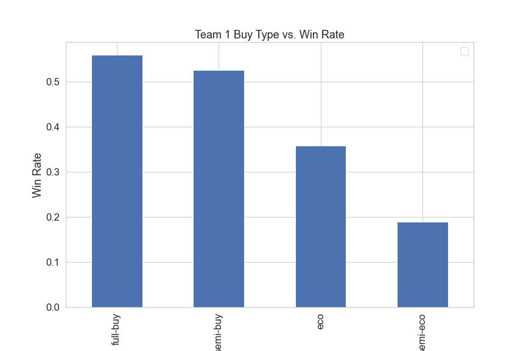
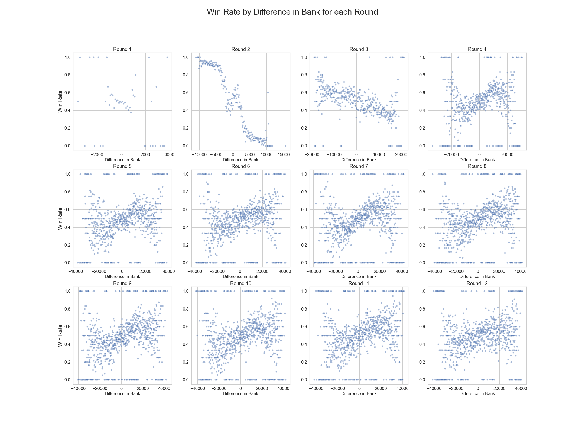
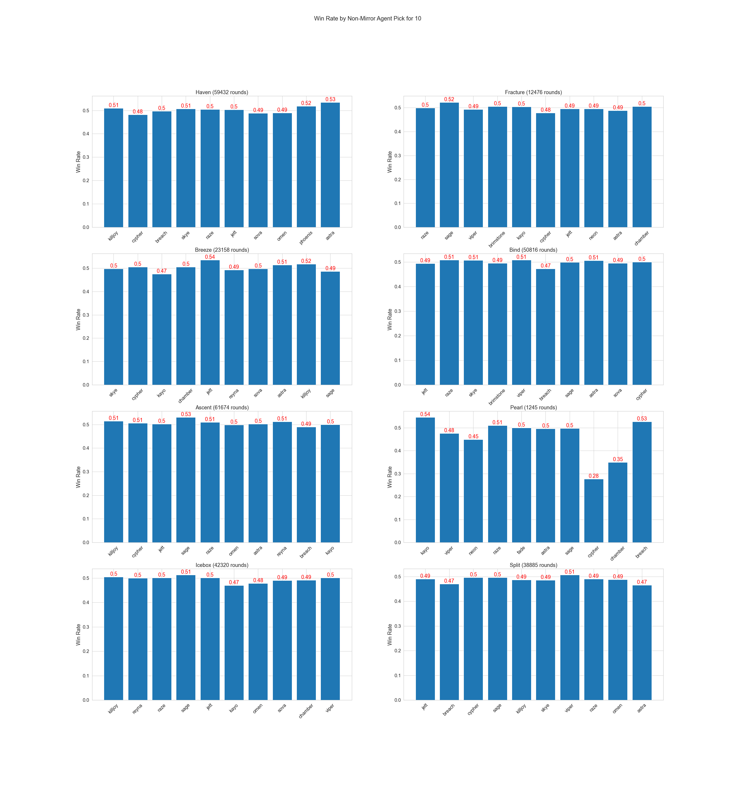

# Capstone Project: Pro Valorant Round Win Predictor

Author:
- Gabriel Wies

## Problem Statement
Using professional Valorant match data scraped from [vlr.gg](https://www.vlr.gg/), can the winner of a round be predicted before the start of the round?

Goal: Balance model performance and informativeness
- Generate a round win predictor for professional Valorant.
- Generate accurate round win probabilities.
- Attributes that lead to a team winning a round.

Benefits:
- Insight into what makes a team win a round.
- Proof of concept for real time round prediction.

## Executive Summary
Valorant is one of the fastest-growing Esports in the world. Since it is still new there have yet to be any round-win predictors in circulation. In a similar game called CSGO, which has been out for 10 years, round win probability is shown as a live stat on pro match streams. This project attempts to determine the viability of a simmilar model in Valorant. After using a scraper for vlr.gg supplied to me by fellow data scientist Joshua Broas, I collected data on around 16,000 of the most recent professional matches. 

Through EDA I found that different rounds had different trends for each variable, as a result, I split the dataset into 6 smaller datasets for Round 1, Round 13, Round 2, Round 3, Overtime Rounds, and the rest of my data. I then attempted to find the best classification models for each of these datasets and extract feature importances. I found that my dataset had correlated columns so I also used PCA to decorrelate my data. In most cases, the models did not improve from PCA and the loss of information from losing feature extraction led me to use my original dataset in the final models. Every one of the final models that I created beat their respective baseline scores. A summary of the findings can be found below:

**Round 1 Win Predictors**:
- Presence of the agent Sage only on one team
- Difference in Bank
- Presence of the agent Jett only on one team

**Round 13 Win Predictors**:
- Presence of the agent Sage only on one team
- Round difference going into the second half
- Difference in bank
- Presence of the agent Skye only on one team

**Round 2 Win Predictors**:
- Pistol round winner was by far the most important feature of this model

**Round 3 Win Predictors**:
- Pistol Round Winner.
- Round 2 Winner.

**Overtime Win Predictors**:
- Almost all of the agents had similar feature importances.

**Round Win Predictors**:
- Whether or not each team full-bought.
- Last Round Winner.

## Inital Data Acquisition: Kaggle ([Valorant Pro Matches - Full Data](https://www.kaggle.com/datasets/visualize25/valorant-pro-matches-full-data))
The initial dataset was acquired from Kaggle. It only contained usable data on 10,000 matches that were all over a year old. 

## Data Acquisition: VLR.gg webscraper ([GitHub](https://github.com/jbroas/valorant-db))
After not being satisfied with the publicly available datasets for professional matches, I contacted the creator of the Kaggle dataset to inquire if I could use his web scraper to collect more recent data. He kindly shared the git repo with me.

The final dataset contained almost data for almost 20,000 professional games of Valorant. 

## Data Ingestion

The web scraper outputted data in the form of a database. I ran a function that collected round-by-round information as well as team agent compositions for 336,913 rounds of professional valorant from the database.

## Data Cleaning:
### Feature Removal:
- The only features that I chose from the scraped database were used so the only feature that was removed before modeling was 'Map' since there was not enough data to make a separate model for each map.

### Missing Values:
- There were only 1,000 missing values in my dataset so they were dropped.

## Data / Features Used:

| Name | Type | Description |
|------|------|-------------|
| **Team1Win** | boolean | Whether or not Team 1 won the round |
| Team1WinLag1 | boolean | Whether or not Team 1 won the last round |
| Team1WinLag2 | boolean | Whether or not Team 1 won the second to last round |
| Team1WinLag3 | boolean | Whether or not Team 1 won the third to last round |
| Team1WinLag4 | boolean | Whether or not Team 1 won the fourth to last round |
| RoundNo | int | Current Round Number |
| RoundDiff | int | The difference in score betwen teams |
| Map | string | The map on which the match was played |
| team1_only_astra | boolean | Presence of the Agent Astra only on Team  1 |
| team2_only_astra | boolean | Presence of the Agent Astra only on Team  2 |
| team1_only_breach | boolean | Presence of the Agent Breach only on Team  1 |
| team2_only_breach | boolean | Presence of the Agent Breach only on Team  2 |
| team1_only_brimstone | boolean | Presence of the Agent Brimstone only on Team  1 |
| team2_only_brimstone | boolean | Presence of the Agent Brimstone only on Team  2 |
| team1_only_chamber | boolean | Presence of the Agent Chamber only on Team  1 |
| team2_only_chamber | boolean | Presence of the Agent Chamber only on Team  2 |
| team1_only_cypher | boolean | Presence of the Agent Cypher only on Team  1 |
| team2_only_cypher | boolean | Presence of the Agent Cypher only on Team  2 |
| team1_only_fade | boolean | Presence of the Agent Fade only on Team  1 |
| team2_only_fade | boolean | Presence of the Agent Fade only on Team  2 |
| team1_only_jett | boolean | Presence of the Agent Jett only on Team  1 |
| team2_only_jett | boolean | Presence of the Agent Jett only on Team  2 |
| team1_only_kayo | boolean | Presence of the Agent Kayo only on Team  1 |
| team2_only_kayo | boolean | Presence of the Agent Kayo only on Team  2 |
| team1_only_killjoy | boolean | Presence of the Agent Killjoy only on Team  1 |
| team2_only_killjoy | boolean | Presence of the Agent Killjoy only on Team  2 |
| team1_only_neon | boolean | Presence of the Agent Neon only on Team  1 |
| team2_only_neon | boolean | Presence of the Agent Neon only on Team  2 |
| team1_only_omen | boolean | Presence of the Agent Omen only on Team  1 |
| team2_only_omen | boolean | Presence of the Agent Omen only on Team  2 |
| team1_only_phoenix | boolean | Presence of the Agent Phoenix only on Team  1 |
| team2_only_phoenix | boolean | Presence of the Agent Phoenix only on Team  2 |
| team1_only_raze | boolean | Presence of the Agent Raze only on Team  1 |
| team2_only_raze | boolean | Presence of the Agent Raze only on Team  2 |
| team1_only_reyna | boolean | Presence of the Agent Reyna only on Team  1 |
| team2_only_reyna | boolean | Presence of the Agent Reyna only on Team  2 |
| team1_only_sage | boolean | Presence of the Agent Sage only on Team  1 |
| team2_only_sage | boolean | Presence of the Agent Sage only on Team  2 |
| team1_only_skye | boolean | Presence of the Agent Skye only on Team  1 |
| team2_only_skye | boolean | Presence of the Agent Skye only on Team  2 |
| team1_only_sova | boolean | Whether or not only Team 1 had the Sova operator |
| team2_only_sova | boolean | Whether or not only Team 2 had the Sova operator |
| team1_only_viper | boolean | Whether or not only Team 1 had the Viper operator |
| team2_only_viper | boolean | Whether or not only Team 2 had the Viper operator |
| team1_only_yoru | boolean | Whether or not only Team 1 had the Yoru operator |
| team2_only_yoru | boolean | Whether or not only Team 2 had the Yoru operator |
| bankDiff | int | The difference in bank between Team 1 and Team 2 |
| bankDiffLag1 | int | The difference in bank between Team 1 and Team 2 in the last round |
| bankDiffLag2 | int | The difference in bank between Team 1 and Team 2 in the second to last round |
| bankDiffLag3 | int | The difference in bank between Team 1 and Team 2 in the third to last round |
| Team1_eco | boolean | Team 1  eco (0-5k) |
| Team1_full-buy | boolean | Team 1 full buy (20,000k+) |
| Team1_semi-buy | boolean | Team 1 semi-buy (10-20k) |
| Team1_semi-eco | boolean | Team 1 semi-eco (5-10k)|
| Team2_eco | boolean | Team 2  eco (0-5k) |
| Team2_full-buy | boolean | Team 2 full buy (20,000k+) |
| Team2_semi-buy | boolean | Team 1 semi-buy (10-20k) |
| Team2_semi-eco | boolean | Team 1 semi-eco (5-10k) |

## Exploratory Data Analysis, Visualizations, and Findings
### Buy Type

- Full-Buy has the highest win rate. A full buy consists of the most powerful weapons in the game. 
- Semi-eco has the lowest win rate. This may be because a semi-eco rarely happens against weaker weapons so they usually lose the round. Semi-ecos are usually done not to win the round, but rather to do economic damage to the enemy team so they cannot full-buy in the next round.

#### Win Rate by Buy Type Matchups
| Team 1 Buy  | Team 2 Buy  | Team 1 Win | Team 2 Win |
|-------------|-------------|------------|-----------|
| eco         | eco         | 0.508300   | 0.491700  |
|     "        | full-buy    | **0.898669** | 0.101331 |
|      "      | semi-buy    | **0.917032** | 0.082968 |
|       "      | semi-eco    | **0.875000** | 0.125000 |
| full-buy    | eco         | 0.120106   | **0.879894** |
|             | full-buy    | 0.506552   | 0.493448 |
|             | semi-buy    | 0.391481   | **0.608519** |
|             | semi-eco    | 0.198000   | **0.802000** |
| semi-buy    | eco         | 0.081161   | **0.918839** |
|             | full-buy    | **0.630026** | 0.369974 |
|             | semi-buy    | 0.503560   | 0.496440 |
|             | semi-eco    | 0.204912   | **0.795088** |
| semi-eco    | eco         | 0.250000   | **0.750000** |
|             | full-buy    | **0.814029** | 0.185971 |
|             | semi-buy    | **0.794924** | 0.205076 |
|             | semi-eco    | 0.333333   | **0.666667** |

- The table above shows the win rates for each team's buy type. The first column is the team's buy type, the second column is the opposing team's buy type, the third and fourth columns are the win rates for each team.

- From the table, we can see that when both teams are ecoing, the win rate is roughly even at 50%. However, when one team is ecoing and the other team is full-buying, the full-buying team has a much higher win rate of 89.9%. This is likely because the full-buying team has more powerful weapons and armor, which gives them a significant advantage over the ecoing team.

- When both teams are full-buying, the win rate is lower at 50.7%. This is likely because both teams have access to the same powerful weapons and armor, so the match is more evenly matched.

- When one team is semi-eco and the other team is full-buying, the win rate is lower at 63.0%. This is likely because the full-buying team has a significant advantage in weapons and armor over the semi-eco team.

- Buy type has a significant impact on win rate. The full-buying team has the highest win rate, followed by the semi-buying team. The ecoing team has the lowest win rate.
### Bank

**There does appear to be a correlation between bank difference and win rate. It changes per round. Rounds 4-12 appear to have the same relationship. As a result, I am going to create separate models for rounds 1, 2, and 3. The other rounds can all be grouped into the same model.**

**Round 2** appears to have a strong negative correlation between the difference in bank and win rate. The change in the relationship can be explained by how the economy in the game functions. In round 2, the team that lost round 1 generally does not buy and therefore has a larger bank. This team almost always loses round 2.

**Round 3** appears to have a negative correlation between the difference in bank and win rate. Round 3 is the 'bonus' round for the team that won rounds 1 and 2 and as a result, they are usually going up against a full buy. They usually lose to the full buy but have a larger bank.

**Rounds above 3** appear to have a positive correlation between the difference in bank and win rate. Rounds 4-12 appear to have the same relationship. As a result, I am going to create separate models for rounds 1, 2, and 3. 
### Agents

**Haven:**
Astra, Pheonix, Killjoy, and Skye all have win rates above .5 for their non-mirror matchup. 

**Fracture:**
Sage is the only agent to have a win rate above .5 for their non-mirror matchup. 

**Breeze:**
Astra, Jett, and Killjoy all have win rates above .5 for their non-mirror matchup. 

**Bind:**
Raze, Skye, Viper, and Astra all have win rates above .5 for their non-mirror matchup. 

**Ascent:**
Sage, Killjoy, Reyna, and Cypher all have win rates above .5 for their non-mirror matchup. 

**Pearl:**
Not enough matches have been played on pearl to determine which agents to pick

**Icebox:**
Sage is the only agent to have a win rate above .5 for their non-mirror matchup. 

**Split:**
Viper is the only agent to have a win rate above .5 for their non-mirror matchup. 
 
## Modeling Approach
For modeling, I began by defining a function that creates a model for 8 of the most commonly used classification: Logistic Regression, XGBoost, Random Forest, KNN Score, Decision Tree, Gradient Boosting, AdaBoost, Gaussian Naive Bayes, Quadratic Discriminant Analysis. Since I had previously established in EDA that my data was multicollinear, I also used PCA to decorrelate my columns and fit models on this data. PCA overall did not improve performance so none of my final models used PCA.  

### Balancing and Scaling Data
Since my dataset was imbalanced (56% of the classification column was 1), I used SMOTE to oversample my data to balance my classes before modeling. I then used StandardScaler to scale my data. 

#### Round 1 Model
Only Gradient Boosting (.563) beat the baseline (.559). **XGBoost (.55)** was still chosen over Gradient boosting since has more balanced precision and recall for 0 and 1 which is better for the models.

#### Round 13 Model
**XGBoost (.59)**, Gradient Boosting (.60), and Random Forest (.58) all have higher accuracies than the Baseline (.57).  While XGBoost and Gradient Boost have higher accuracies than Random Forests, Random Forests is more balanced more false positives so it is chosen as a result.

#### Round 2 Model
**XGBoost (.88)** and Gradient Boosting (.88) both perform the same as Win Lag 1 baseline (.88). Gradient Boosting has a slightly worse recall for 1 when compared to XGBoost. While the accuracy of XGBoost is the same as Baseline, it is slightly more balanced for precision and recall for 0 and 1. As a result, XGBoost is chosen.

The models all performed similarly, with the XGBoost model performing slightly better than the other two. The XGBoost model should be used because it is faster to train and has higher accuracy.

XGBoost should be used as the preferred model as it outperforms the baseline model and the other two models tested. It has higher precision, recall, and f1-score

#### Round 3 Model
Both **XGBoost (.68)** and Gradient Boosting (.68) have higher accuracies than the baseline (.55). XGBoost is chosen over Gradient Boosting since its precision and recall for 0 and 1 are more balanced than Gradient Boosting.

#### Round 4 Model
XGBoost (.68) and **Gradient Boosting(.69)** perform better than the Time Lag 1 baseline (.60). Both models have similar balancing between precisions and recall so Gradient Boosting is chosen since it has a higher accuracy score.

#### Overtime Model
**XGBoost (.60)** and Gradient Boosting (.59) have similar accuracies and are both above the baseline (.58). XGBoost is chosen since all of its accuracies is higher and its precision and recall are more balanced for 0 and 1.

#### Mid-Game Model
**XGBoost (.67)** performs better than the baseline (.60) and Gradient Boosting (.66) so it is chosen.

## Findings from Models
- The presence of a healer (Skye and Sage) on the team is the largest predictor of winnning a pistol round
- The team that wins pistol almost always wins round 2
- A lot of agent win rates are map dependant
- A semi-eco buy almost always loses

## Limitations
- Since my model was already split by round I was unable to split by map as well since the datasets would become too small. Once more games have been played this may be possible to create an even more accurate model. 

## Recommendations / Next Steps
The next step would be to use software to scrape data directly from maps. This would allow for mid-round prediction to be possible. Another next step would be to create models on the data by map and round. Introducing player and team data could also allow for more accurate predictions. Another way to make the feature importances of the models even better would be to swap all the Team 1 data points with Team 2 and train the models on the combined dataset. This prevents the model from favoring either team over the other when creating the models. 

## Table of Contents
- code
    - 1PreProcessingforEDA.ipynb: Extracting data from db file. Adding time lags and doing basic data cleaning.
    - 2EDA.ipynb: Visualizations and Interpretations as well as encoding certain variables after visualizations
    - 3PreprocessingforModel.ipynb.
    - 04ModelSelection: Classification models + performance evaluations.
    - functions.py: Functions utalized throughout the notebooks including all the modeling functions.
- images
    - Relevant visualizations

- data
    - [valorant.db](https://www.kaggle.com/datasets/visualize25/valorant-pro-matches-full-data)
    - [round_comps.csv](https://drive.google.com/file/d/1JwK_pP3wcTVJzQD60x6T5TDkm8d4BzLa/view?usp=sharing)
    - modeling1.csv
    - round_p.csv
    - round_1.csv
    - round_13.csv
    - round_2.csv
    - round_3.csv
    - round_4.csv
    - round_ot.csv
    - rounds.csv
- correlation
    - output.txt: Contains correlations for all columns in the modeling1.csv dataset.

## Software Requirements
- Pandas
- sqlite3
- ast
- sklearn
- matplotlib
- seaborn
- pickle
- XGBoost
- imblearn

## Acknowledgments
- [VLR.gg](vlr.gg)

### Special thanks to Joshua Broas who sent me his web scraper code after I tracked him down :)